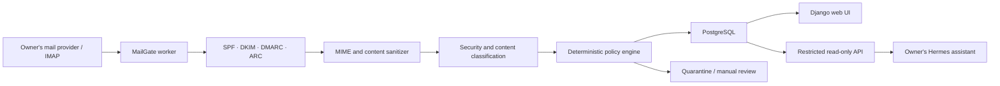

# MailGate

> **Deutsch:** MailGate wird ein selbst gehostetes E-Mail-Sicherheitstor für den persönlichen Hermes-Assistenten. Es prüft und bereinigt Nachrichten und gibt ausschließlich freigegebene Inhalte über eine streng begrenzte Lese-API weiter. Das Projekt befindet sich noch in der Planungsphase; es gibt noch keine installierbare Anwendung.

MailGate is a planned open-source, self-hosted Docker application that places a deliberately narrow security boundary between a personal mailbox and an AI assistant.

Each installation belongs to one owner and connects only to that owner's mailboxes. MailGate will inspect authentication signals such as SPF, DKIM, DMARC, and ARC, safely normalize message content, assess security risks, categorize messages, and apply deterministic policy rules. Only sanitized and explicitly approved information may be exposed to Hermes.

## Project status

**Phase 1 foundation — implementation started.** The repository now contains a minimal Django web process, a separate inert worker process, PostgreSQL, a Caddy ingress boundary, file-backed Compose secrets, container hardening, and health checks. It does not yet ingest or classify mail and is not a production release.

The threat model, initial process privileges, data flow, version-one scope, and AGPL-3.0 license baseline are recorded. The first implementation phase starts with the technical mail-filter foundation and no AI dependency.

## Run the development foundation

Prerequisites: Docker Engine with Docker Compose and Python 3.12 or newer for the one-time local secret generator.

```text
python scripts/create_local_secrets.py
docker compose up --build -d
```

Then check `http://127.0.0.1:8080/health/live` and `/health/ready`. This starts only the foundation; no mailbox should be connected yet. See [docs/development.md](docs/development.md) for operation and validation details.

## Core security boundaries

- Email content is untrusted data, never an instruction channel.
- Hermes never receives IMAP, SMTP, database, deletion, move, or write access.
- The classifier receives no mailbox credentials and has no tools.
- Model output is treated as untrusted input and must match a strict schema.
- Only deterministic application policy can change message state.
- Suspicious, ambiguous, or failed processing is quarantined or held for review; it is not silently deleted.
- The Hermes API is read-only and exposes only sanitized, approved data with the minimum scope `messages:read:approved`.
- Each installation manages only its owner's data; there is no central MailGate customer database.
- Telemetry is disabled by default.

The initial API design intentionally excludes sending, replying, deleting, moving, raw attachment downloads, quarantine access, and access to unprocessed messages.

See the [threat model](docs/threat-model.md) and [architecture](docs/architecture.md) for the complete planning baseline.

## Planned architecture



The planned reference deployment uses separate `web`, `worker`, `db`, and `proxy` containers with distinct responsibilities and network access. An optional Hermes adapter may be added later, but it must not broaden the API's capabilities.

## Planned scope

MailGate aims to provide:

- a responsive graphical setup flow;
- Docker Compose as the reference installation;
- multiple owner-controlled IMAP mailboxes per installation;
- safe MIME parsing and content sanitization;
- authentication and anti-spam signal evaluation;
- quarantine, review, categories, priorities, and deterministic rules;
- an interchangeable OpenAI-compatible classification provider;
- revocable, expiring, rate-limited read-only Hermes credentials;
- audit records that avoid unnecessary sensitive content;
- German and English user interfaces.

MailGate does **not** claim to eliminate prompt injection. Prompt detection and model instructions are defense-in-depth measures, not security boundaries. The design instead limits reachable data and possible actions when content or classification is malicious.

## Repository layout

```text
mailgate/
├── compose.yaml          # Reference development stack
├── Dockerfile            # Shared non-root web/worker image
├── pyproject.toml        # Python project and direct dependency metadata
├── requirements.lock     # Hash-locked Python dependency graph
├── app/                  # Django foundation; future UI and read-only API
├── worker/               # Worker foundation; future mail inspection
├── scripts/              # Safe local development helpers
├── tests/
│   ├── fixtures/         # Synthetic, non-personal test messages
│   └── adversarial/      # Prompt-injection and parser security cases
├── docs/
│   ├── decisions/        # Architectural and governance decisions
│   ├── providers/        # Provider-specific documentation
│   ├── architecture.md
│   ├── threat-model.md
│   └── projektplan.md
├── deploy/               # Proxy configuration and deployment guidance
└── .github/workflows/    # CI and dependency review automation
```

## Development roadmap

1. Completed: finalize the license, initial boundaries, threat model, and data flow.
2. Build the technical mail filter without AI: ingestion, authentication checks, sanitization, persistence, quarantine, and idempotency.
3. Add schema-constrained classification and deterministic policies.
4. Build the graphical setup and review interface.
5. Add and test the minimal read-only Hermes integration.
6. Harden containers, secrets, backups, audit behavior, and adversarial tests before a public release.

The detailed working plan is available in German in [docs/projektplan.md](docs/projektplan.md).

## Security

Do not open a public issue for a suspected vulnerability or include real mailbox data, credentials, tokens, private addresses, or message content in reports. Follow [SECURITY.md](SECURITY.md) to use GitHub's private vulnerability reporting.

## Contributing

Design feedback, threat-model review, documentation, tests, and focused code contributions are welcome; see [CONTRIBUTING.md](CONTRIBUTING.md).

## License

MailGate is licensed under the [GNU Affero General Public License v3.0](LICENSE). The accepted decision and its consequences are recorded in [docs/decisions/0001-project-license.md](docs/decisions/0001-project-license.md).
