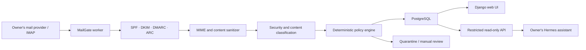

# MailGate

> **Deutsch:** MailGate wird ein selbst gehostetes E-Mail-Sicherheitstor für den persönlichen Hermes-Assistenten. Es prüft und bereinigt Nachrichten und gibt ausschließlich freigegebene Inhalte über eine streng begrenzte Lese-API weiter. Das Projekt befindet sich noch in der Planungsphase; es gibt noch keine installierbare Anwendung.

MailGate is a planned open-source, self-hosted Docker application that places a deliberately narrow security boundary between a personal mailbox and an AI assistant.

Each installation belongs to one owner and connects only to that owner's mailboxes. MailGate will inspect authentication signals such as SPF, DKIM, DMARC, and ARC, safely normalize message content, assess security risks, categorize messages, and apply deterministic policy rules. Only sanitized and explicitly approved information may be exposed to Hermes.

## Project status

**Phase 0 — security and product decisions.** This repository currently contains planning and security documentation only. It does not yet contain an application, Docker image, or deployable Compose stack.

Application development will not start until the threat model, process privileges, data flow, version-one scope, and project license have been agreed and recorded.

## Core security boundaries

- Email content is untrusted data, never an instruction channel.
- Hermes never receives IMAP, SMTP, database, deletion, move, or write access.
- The classifier receives no mailbox credentials and has no tools.
- Model output is treated as untrusted input and must match a strict schema.
- Only deterministic application policy can change message state.
- Suspicious, ambiguous, or failed processing is quarantined or held for review; it is not silently deleted.
- The Hermes API is read-only and exposes only sanitized, approved data with the minimum scope `messages:read:approved`.
- Each installation manages only its owner's data; there is no central MailGate customer database.
- Telemetry is disabled by default.

The initial API design intentionally excludes sending, replying, deleting, moving, raw attachment downloads, quarantine access, and access to unprocessed messages.

See the [threat model](docs/threat-model.md) and [architecture](docs/architecture.md) for the complete planning baseline.

## Planned architecture



The planned reference deployment uses separate `web`, `worker`, `db`, and `proxy` containers with distinct responsibilities and network access. An optional Hermes adapter may be added later, but it must not broaden the API's capabilities.

## Planned scope

MailGate aims to provide:

- a responsive graphical setup flow;
- Docker Compose as the reference installation;
- multiple owner-controlled IMAP mailboxes per installation;
- safe MIME parsing and content sanitization;
- authentication and anti-spam signal evaluation;
- quarantine, review, categories, priorities, and deterministic rules;
- an interchangeable OpenAI-compatible classification provider;
- revocable, expiring, rate-limited read-only Hermes credentials;
- audit records that avoid unnecessary sensitive content;
- German and English user interfaces.

MailGate does **not** claim to eliminate prompt injection. Prompt detection and model instructions are defense-in-depth measures, not security boundaries. The design instead limits reachable data and possible actions when content or classification is malicious.

## Repository layout

```text
mailgate/
├── app/                  # Planned Django web UI and read-only API
├── worker/               # Planned mail ingestion and inspection worker
├── tests/
│   ├── fixtures/         # Synthetic, non-personal test messages
│   └── adversarial/      # Prompt-injection and parser security cases
├── docs/
│   ├── decisions/        # Architectural and governance decisions
│   ├── providers/        # Provider-specific documentation
│   ├── architecture.md
│   ├── threat-model.md
│   └── projektplan.md
├── deploy/               # Planned Docker Compose deployment files
└── .github/workflows/    # CI and security automation once code exists
```

## Development roadmap

1. Finalize the license, version-one boundaries, threat model, and data flow.
2. Build the technical mail filter without AI: ingestion, authentication checks, sanitization, persistence, quarantine, and idempotency.
3. Add schema-constrained classification and deterministic policies.
4. Build the graphical setup and review interface.
5. Add and test the minimal read-only Hermes integration.
6. Harden containers, secrets, backups, audit behavior, and adversarial tests before a public release.

The detailed working plan is available in German in [docs/projektplan.md](docs/projektplan.md).

## Security

Do not open a public issue for a suspected vulnerability or include real mailbox data, credentials, tokens, private addresses, or message content in reports. Follow [SECURITY.md](SECURITY.md) to use GitHub's private vulnerability reporting.

## Contributing

The project is not accepting code contributions while the license and contribution terms remain undecided. Design feedback and threat-model review are welcome; see [CONTRIBUTING.md](CONTRIBUTING.md).

## License

**No open-source license has been selected yet.** Until a license file is added, copyright law applies and no permission is granted to use, modify, or redistribute the contents beyond rights provided directly by GitHub's terms. The decision and its criteria are tracked in [docs/decisions/0001-project-license.md](docs/decisions/0001-project-license.md).
