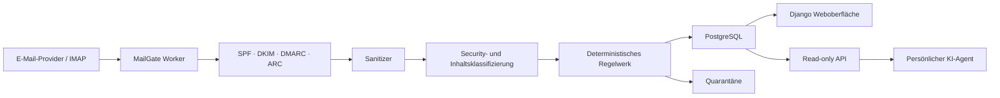

# Projektplan: MailGate

Stand: 17. Juli 2026

Status: Produktvision und Kommunikationsgrundlage. Für den technischen V1-Umfang sind
`docs/decisions/0002-v1-security-boundaries.md` und `docs/release-gates.md` verbindlich.

V1 ist bewusst kleiner als die langfristige Vision in diesem Dokument: MailGate sendet keine
E-Mails, enthält keinen externen Modell- oder MCP-Aufruf, lädt keine Anhangsinhalte herunter und
bewertet SPF/DMARC/ARC aus IMAP-Nachrichten nur als Provider-Behauptungen. DKIM wird zusätzlich
unabhängig über unveränderte Rohbytes und begrenzte DNS-TXT-Abfragen geprüft. Klassifizierungs- und
Adapterideen bleiben spätere, gesondert zu bedrohungsmodellierende Ausbaustufen.

Projektname: **MailGate**

Repository: **AlfMueller/mailgate**

## 1. Kurzfassung

MailGate ist eine selbst gehostete Docker-Anwendung, die ein persönliches
E-Mail-Postfach technisch und inhaltlich vorsortiert. Sie prüft klassische
Spam- und Absendermerkmale, bereinigt fremde Inhalte, kategorisiert Nachrichten
und gibt ausschließlich freigegebene Informationen über eine eng begrenzte
Lese-Schnittstelle an den persönlichen KI-Agenten weiter.

Jeder Anwender betreibt seine eigene Instanz. Es gibt keinen zentralen
MailGate-Dienst, keine gemeinsame Kundendatenbank und standardmäßig keine
Telemetrie. Ein Fehler oder Angriff in einer Installation darf keine andere
Installation betreffen.

Das Projekt wird als **ein Inhalt in drei Formen** veröffentlicht:

| Ort | Aufgabe |
| --- | --- |
| GitHub | Quellcode, Installation, Sicherheitsmodell und reproduzierbare Tests |
| Website | verständliche Projektdokumentation, Hintergründe und Ergebnisse |
| YouTube | Problem, Bauprozess, Angriffstest und funktionierende Demonstration |

## 2. Problem

Ein KI-Agent kann beim Lesen einer E-Mail nicht zuverlässig unterscheiden,
ob ein Text Information oder eine an ihn gerichtete Anweisung ist. Eine fremde
Nachricht kann deshalb versuchen, den KI-Agenten durch Prompt Injection zu
manipulieren.

Gleichzeitig ist ein vollständiger Mail-Agent mit Lese-, Sende- und
Löschrechten für eine reine Postfachsortierung unnötig mächtig. MailGate löst
das Problem nicht mit einem angeblich perfekten Prompt, sondern durch eine
technische Trennung:

- E-Mails sind grundsätzlich nicht vertrauenswürdige Daten.
- Die klassifizierende KI besitzt keine Werkzeuge und keine Mail-Zugangsdaten.
- Ein fest programmiertes Regelwerk entscheidet über erlaubte Aktionen.
- Der KI-Agent erhält nur bereinigte, freigegebene Daten über eine Read-only-API.
- Unklare oder verdächtige Nachrichten werden nicht gelöscht, sondern
  quarantänisiert.

## 3. Produktversprechen

> Installiere MailGate selbst, verbinde dein eigenes Postfach und erzeuge einen
> begrenzten Schlüssel, mit dem ausschließlich dein KI-Agent freigegebene
> Nachrichten lesen kann.

Der technische V1-Erfolgsmoment soll innerhalb von 15 Minuten erreichbar sein:

1. lokalen Doctor ausführen und `docker compose up -d` starten
2. Einrichtungsassistent im Browser öffnen
3. eigenes Postfach verbinden und die TLS-/Read-only-Verbindung testen
4. Testnachricht synchronisieren, prüfen und freigeben
5. zeitlich begrenzten Agenten-Schlüssel erzeugen
6. erste freigegebene, bereinigte Nachricht über die private Read-only-API lesen

## 4. Zielgruppe

- technisch interessierte Einzelpersonen
- Maker und Entwickler mit einem öffentlichen Kontaktpostfach
- Selbsthoster mit NAS, Mini-PC oder Linux-Server
- Nutzer persönlicher KI-Agenten
- kleine Projekte, Vereine oder Einzelunternehmen mit überschaubarem
  Mailaufkommen

## 5. Langfristiges Zielbild nach der technischen V1

Die folgenden Punkte beschreiben geplante Ausbaustufen. Sie sind nicht Bestandteil der in ADR 0002
festgelegten technischen V1, sofern sie dort ausdrücklich ausgeschlossen werden.

### Geplant

- eine selbst gehostete Installation pro Besitzer
- mehrere eigene IMAP-Postfächer pro Installation
- Docker Compose und dokumentierte Updates
- grafische, responsive Weboberfläche
- Hostpoint-Preset sowie generische IMAP-/SMTP-Konfiguration
- technischer Spam- und Authentifizierungsfilter
- inhaltliche Kategorien, Prioritäten, Themen und Aktionen
- Quarantäne und manuelle Korrektur
- austauschbarer, OpenAI-kompatibler Klassifizierungsanbieter
- streng strukturierte KI-Ausgabe
- Read-only-REST-API für KI-Agenten
- optionaler Read-only-MCP- oder KI-Agenten-Adapter
- API-Schlüssel mit Berechtigungen, Ablaufdatum und Widerruf
- Auditprotokoll ohne unnötige Speicherung sensibler Inhalte
- deutsch- und englischfähige Oberfläche; Deutsch beginnt als
  Referenzsprache

### Bewusst nicht enthalten

- kein zentraler MailGate-Cloud-Dienst
- kein Zugriff auf das private Hauptpostfach des Betreibers
- kein autonomes Antworten durch den KI-Agenten
- kein sofortiges, KI-gesteuertes Löschen
- kein Öffnen von Links oder Nachladen externer Bilder
- keine automatische Ausführung von Mail-Anweisungen
- kein Docker-Socket, keine Shell und keine Dateisystemwerkzeuge für die KI
- keine zentrale Telemetrie oder gemeinsame Trainingsdatenbank

## 6. Sicherheitsmodell

### Schützenswerte Werte

- Zugangsdaten des öffentlichen Postfachs
- Inhalt eingehender Nachrichten
- private Weiterleitungsadresse
- Schlüssel des Klassifizierungsanbieters
- MailGate-Schlüssel für den KI-Agenten
- Kategorisierungs- und Auditdaten

### Angreifbare Eingaben

- Absender, Betreff und Nachrichtentext
- HTML, unsichtbarer Text und Unicode-Steuerzeichen
- Dateinamen und Anhänge
- URLs, externe Bilder und Trackingelemente
- gefälschte Mail-Header
- absichtlich präparierte Prompt-Injection-Texte
- kompromittierte oder bösartige Absenderdomains

### Belastbare Sicherheitsgrenzen

- getrennte Container und getrennte Docker-Netzwerke
- nicht-root Prozesse und minimale Linux-Berechtigungen
- kein direkter Netzwerkpfad vom KI-Agenten zum IMAP-Server
- keine Mail-Zugangsdaten im KI-Agenten-Container
- festes, validiertes Datenschema zwischen KI und Regelwerk
- feste Empfänger und fest erlaubte Aktionen im Programmcode
- Read-only-KI-Agenten-API mit minimalem Berechtigungsumfang
- Quarantäne und zeitverzögerte Löschung

Prompt-Injection-Erkennung, Systemprompts und Inhaltsfilter sind zusätzliche
Schutzschichten, aber keine alleinigen Sicherheitsgrenzen.

## 7. Filtermodell

MailGate verwendet keine einzige riesige Kategorie. Jede Nachricht erhält
mehrere voneinander unabhängige Merkmale:

```json
{
  "security": "clean",
  "authentication": "aligned",
  "type": "project_request",
  "priority": "high",
  "topics": ["robotics", "youtube"],
  "recommended_action": "forward",
  "confidence": 0.93
}
```

### Filterstufe 1: Transport und Authentifizierung

- Hostpoint- beziehungsweise Provider-Spamwert
- SPF-Ergebnis
- DKIM-Ergebnis und signierende Domain
- DMARC-Ergebnis und Domain-Alignment
- ARC-Ergebnis bei Weiterleitungen und Mailinglisten
- vertrauenswürdige `Authentication-Results`-Header
- Abweichungen zwischen `From`, `Sender`, `Return-Path` und `Reply-To`
- ungewöhnliche oder widersprüchliche `Received`-Kette

MailGate vertraut nicht jedem gleichnamigen Header. Es wertet nur Ergebnisse
aus, die vom konfigurierten empfangenden Mailserver stammen. Fehlende
Authentifizierung ist ein Risikosignal, aber allein kein Löschgrund.

### Filterstufe 2: Sichere Aufbereitung

- Nachrichtengröße und Zeichensatz begrenzen
- MIME-Struktur sicher parsen
- HTML in bereinigten Klartext umwandeln
- Skripte, Formulare, Styles und unsichtbare Bereiche entfernen
- externe Bilder und Trackingpixel nicht laden
- URLs nur als Text behandeln und normalisieren
- Unicode-Steuerzeichen und Homographen sichtbar machen
- Anhänge nur inventarisieren, nicht ausführen
- sensible Inhalte vor externen Modellaufrufen optional maskieren

### Filterstufe 3: Sicherheitsbewertung

- Spam
- Phishing
- mögliche Prompt Injection
- gefährlicher oder unbekannter Anhang
- Identitäts- beziehungsweise Domain-Imitation
- verdächtiger Link
- unklare Authentifizierung

### Filterstufe 4: Inhaltliche Einordnung

Standardtypen:

- persönliche Nachricht
- Projektanfrage
- Supportfrage
- Rechnung oder Vertrag
- Newsletter
- Systemmeldung
- Werbung
- Social-Media- oder Plattformbenachrichtigung
- unbekannt

Standardprioritäten:

- dringend
- wichtig
- normal
- niedrig
- unbekannt

Eigene Themen können in der Oberfläche ergänzt werden, beispielsweise
Robotik, Elektronik, GitHub, YouTube oder Website.

### Filterstufe 5: Regelwerk

```text
WENN security != clean
DANN quarantine

WENN confidence < 0.70
DANN needs_review

WENN priority = high UND confidence >= 0.85
DANN forward

WENN type = newsletter
DANN daily_digest
```

Die KI empfiehlt eine Aktion. Nur das deterministische Regelwerk darf den
tatsächlichen Status verändern.

## 8. Nachrichtenstatus

```text
received
  → authenticated
  → sanitized
  → scanned
  → approved
       ↘ forwarded
       ↘ exposed_to_agent

jeder Schritt kann führen zu:
  → needs_review
  → quarantined
  → expired
```

Der Begriff `approved` bedeutet, dass die Nachricht die konfigurierten Regeln
erfüllt. Er bedeutet nicht, dass ihr Inhalt objektiv wahr oder vollständig
ungefährlich ist.

## 9. KI-Agenten-Schnittstelle

Der KI-Agent erhält niemals IMAP-, SMTP- oder Datenbankzugriff. MailGate erzeugt
einen eigenen Schlüssel mit dem minimalen Scope:

```text
messages:read:approved
```

Erlaubte Endpunkte der ersten Version:

```text
GET /api/v1/messages?state=approved
GET /api/v1/messages/{id}/summary
GET /api/v1/categories
```

Nicht vorhandene Endpunkte sind genauso wichtig:

- kein Löschen
- kein Verschieben
- kein Versand
- kein Antworten
- kein Download roher Anhänge
- kein Zugriff auf Quarantäne oder unbearbeitete Nachrichten

Der Schlüssel wird nur einmal angezeigt und danach ausschließlich als Hash
gespeichert. Er besitzt ein Ablaufdatum, ein Rate-Limit, einen letzten
Verwendungszeitpunkt und kann sofort widerrufen werden.

Ein Schlüssel allein identifiziert nur seinen Besitzer. Deshalb gilt:

- API standardmäßig nur im privaten Docker-Netzwerk bereitstellen
- bei getrennt betriebenem KI-Agenten Tailscale, WireGuard oder mTLS verwenden
- optional feste Quell-IP konfigurieren
- jeden Zugriff auditieren

Ein optionaler KI-Agenten- oder MCP-Adapter bildet genau diese lesenden
Endpunkte ab und stellt keine weiteren Mail-Werkzeuge bereit.

## 10. Langfristige Zielarchitektur



### Container

| Container | Aufgabe | Externe Verbindungen |
| --- | --- | --- |
| `web` | Django-Oberfläche und API | keine direkten Mailverbindungen |
| `worker` | IMAP, Aufbereitung, Klassifizierung | Mailprovider und freigegebener Modellprovider |
| `db` | PostgreSQL | nur internes Docker-Netzwerk |
| `proxy` | HTTPS und lokale Webadresse | eingehendes HTTPS |
| `agent-adapter` | optionaler Read-only-Adapter | nur MailGate und KI-Agent |

Web und Worker werden aus demselben versionierten Image gebaut, laufen aber
als getrennte Prozesse und mit unterschiedlichen Netzwerkrechten.

### Technische Basis

- Python 3.12 oder eine bei Projektstart aktuelle unterstützte Python-Version
- Django und PostgreSQL
- serverseitig gerenderte Oberfläche mit möglichst wenig JavaScript
- klar versionierte REST-API
- Docker Compose als Referenzinstallation
- Caddy oder gleichwertiger Reverse Proxy für HTTPS
- Docker Secrets beziehungsweise gemountete Secret-Dateien
- reproduzierbare Builds und Software Bill of Materials

## 11. Grafische Oberfläche

### Langfristiger Einrichtungsassistent

1. Besitzerkonto erstellen
2. Postfachanbieter auswählen
3. IMAP-Verbindung testen
4. Quarantäneordner anlegen
5. Klassifizierungsanbieter konfigurieren
6. Testnachricht analysieren
7. Regeln und Aufbewahrungsdauer bestätigen
8. KI-Agenten-Schlüssel erzeugen
9. KI-Agenten-Konfiguration herunterladen

### Hauptbereiche

- Übersicht mit Anzahl wichtiger, unklarer und quarantänisierter Nachrichten
- Nachrichtenansicht mit technischen Prüfergebnissen
- verständliche Begründung jeder Klassifizierung
- Quarantäne mit Wiederherstellung
- Regeln, Kategorien und Absenderlisten
- Postfach- und Provider-Einstellungen
- KI-Agenten-Schlüssel und Zugriffsprotokoll
- Systemzustand, Updates und Diagnose

## 12. Datenschutz und Datensparsamkeit

- keine zentrale Benutzerregistrierung
- keine Telemetrie als Voreinstellung
- keine Weitergabe an MailGate-Projektserver
- externe Modellaufrufe transparent kennzeichnen
- nur benötigte Nachrichtenteile an einen Modellprovider senden
- optional lokales OpenAI-kompatibles Modell unterstützen
- rohe Nachrichten nur so lange wie konfiguriert aufbewahren
- Auditprotokolle möglichst mit IDs und Hashes statt vollem Inhalt führen
- Export und vollständige Löschung der lokalen Daten ermöglichen
- Zugangsdaten verschlüsselt speichern; Master-Key außerhalb der Datenbank

## 13. Fehlerverhalten

MailGate arbeitet im Zweifel defensiv:

| Fehler | Verhalten |
| --- | --- |
| IMAP nicht erreichbar | später erneut versuchen, nichts löschen |
| DNS-/Authentifizierungsfehler | `needs_review`, nicht automatisch verwerfen |
| Klassifizierungsanbieter nicht erreichbar | Nachricht unbearbeitet lassen |
| ungültiges KI-JSON | `needs_review` |
| unbekannte Kategorie | Ergebnis ablehnen |
| zu große Mail | Metadaten anzeigen, Inhalt quarantänisieren |
| verdächtiger Anhang | nicht öffnen, Quarantäne |
| Datenbankfehler | Verarbeitung stoppen und protokollieren |

## 14. Teststrategie

### Automatische Tests

- MIME- und Header-Parser
- SPF-/DKIM-/DMARC-/ARC-Auswertung
- gefälschte `Authentication-Results`-Header
- HTML- und Unicode-Sanitizer
- JSON-Schema und Regelwerk
- API-Berechtigungen
- Mandantentrennung innerhalb einer Installation, soweit Rollen vorhanden sind
- Wiederholung und Idempotenz anhand IMAP-UIDs
- Migrationen und Updatepfad
- Backup und Wiederherstellung

### Adversariale Tests

- Microsoft LLMail-Inject-Testfälle
- sichtbare und unsichtbare Prompt Injection
- Anweisungen in Betreff, HTML, Signatur und Anhängen
- gefälschte Support- und Rechnungsnachrichten
- Link- und Bild-basierte Datenabflussversuche
- manipulierte Freigabegründe
- gestohlener oder abgelaufener KI-Agenten-Schlüssel
- Versuch, nicht erlaubte API-Methoden aufzurufen

### Pilotbetrieb

Ein dediziertes, isoliertes Pilotpostfach dient als erster realer Test. Vor
öffentlicher Freigabe werden mindestens vier Wochen lang Fehlklassifizierungen,
Quarantäneentscheidungen und Systemausfälle protokolliert und ausgewertet.

Aktueller DNS-Ausgangspunkt:

- MX zeigt auf Hostpoint.
- SPF verweist auf `spf.mail.hostpoint.ch`.
- DMARC ist noch einzurichten.
- DKIM ist nach Einrichtung der Mailadresse bei Hostpoint und im extern
  verwalteten DNS zu prüfen.

## 15. Entwicklungsphasen

### Phase 0: Entscheidungen und Bedrohungsmodell

- Projektname und Repository-Namen festhalten (**entschieden: MailGate / AlfMueller/mailgate**)
- Lizenz auswählen (**entschieden: AGPL-3.0-only**)
- Sicherheitsmodell und Nicht-Ziele festschreiben
- Referenz-Mailprovider Hostpoint konfigurieren
- Beispieldaten ohne reale personenbezogene Inhalte erstellen

**Abnahme:** Bedrohungsmodell, Datenfluss und Rechte jedes Prozesses sind
dokumentiert.

### Phase 1: Technischer Mailfilter

- Docker-Grundgerüst
- IMAP-Abruf
- sichere MIME-Verarbeitung
- Header- und Authentifizierungsauswertung
- PostgreSQL-Schema
- Quarantäne und Idempotenz

**Abnahme:** Testmails werden reproduzierbar eingelesen, geprüft und ohne KI
einsortiert.

### Phase 2: Klassifizierung und Regeln

- OpenAI-kompatibler Provideradapter
- streng validiertes Ergebnisschema
- Kategorien, Prioritäten und Themen
- deterministisches Regelwerk
- Fail-closed-Verhalten und Auditlog

**Abnahme:** Manipulierte Modellantworten können keine nicht erlaubte Aktion
auslösen.

### Phase 3: Grafische Oberfläche

- Erstinstallation und Besitzerkonto
- Postfachassistent
- Übersicht und Nachrichtendetails
- Quarantäne und Korrektur
- Regeln und Kategorien
- Sicherheits- und Systemstatus

**Abnahme:** Ein neuer Nutzer kann MailGate ohne Bearbeiten von Dateien
einrichten.

### Phase 4: KI-Agenten-Integration

- Read-only-API
- API-Schlüssel, Scopes, Ablauf und Widerruf
- optionaler KI-Agenten- oder MCP-Adapter
- Zugriff nur auf freigegebene, bereinigte Daten
- private Netzwerkvariante dokumentieren

**Abnahme:** Der KI-Agent kann freigegebene Zusammenfassungen lesen, aber keine
Mailaktion ausführen und keine Rohdaten abrufen.

### Phase 5: Härtung und Pilot

- Container ohne Root und mit reduzierten Capabilities
- schreibgeschützte Dateisystembereiche
- Secret- und Backup-Konzept
- Rate-Limits und Auditierung
- LLMail-Inject-Tests
- vierwöchiger Pilot mit einem dedizierten, isolierten Pilotpostfach
- Security- und Datenschutzdokumentation

**Abnahme:** Kritische Tests sind bestanden; bekannte Restrisiken sind
veröffentlicht.

### Phase 6: Veröffentlichung

- versioniertes Docker-Image
- signierte Release-Artefakte und Prüfsummen
- Installations- und Updateanleitung
- GitHub-Repository und Security Policy
- Website-Artikel
- YouTube-Video
- gegenseitige Verlinkung aller drei Orte

**Abnahme:** Eine fremde Testperson installiert MailGate anhand der öffentlichen
Anleitung und verbindet ein eigenes Testpostfach.

## 16. GitHub-Repository

### Vorgeschlagene Struktur

```text
mailgate/
├── app/
├── worker/
├── tests/
│   ├── fixtures/
│   └── adversarial/
├── docs/
│   ├── architecture.md
│   ├── threat-model.md
│   ├── ai-agent-integration.md
│   └── providers/
├── deploy/
│   └── docker-compose.yml
├── .github/
│   ├── workflows/
│   └── SECURITY.md
├── Dockerfile
├── README.md
├── LICENSE
└── CHANGELOG.md
```

### README-Aufbau

1. Problem und Sicherheitsidee
2. Screenshot der Oberfläche
3. Was MailGate kann und bewusst nicht kann
4. Installation in fünf Schritten
5. KI-Agenten verbinden
6. Architekturdiagramm
7. Sicherheitsmodell
8. unterstützte Provider
9. Backup und Updates
10. Mitwirken und Sicherheitslücken melden

### Veröffentlichungssicherheit

- keine echten Mailadressen, Passwörter oder API-Schlüssel in Fixtures
- Secret-Scanning und Dependency-Scanning in CI
- minimale, gepinnte Basisimages
- SBOM und bekannte Abhängigkeiten pro Release
- `SECURITY.md` mit privatem Meldeweg
- keine Behauptung, Prompt Injection vollständig zu lösen

## 17. Ein Inhalt für GitHub, Website und YouTube

### Gemeinsames Demonstrationsszenario

Ein einziges, reproduzierbares Szenario trägt alle drei Veröffentlichungen:

1. Eine normale technische Projektanfrage trifft ein.
2. Eine zweite Mail enthält eine sichtbare Prompt Injection.
3. Eine dritte Mail enthält eine versteckte HTML-Anweisung und gefälschte
   Authentifizierungs-Header.
4. MailGate zeigt SPF, DKIM, DMARC, Inhaltsrisiko und Kategorie.
5. Nur die echte Projektanfrage wird für den KI-Agenten freigegeben.
6. Der KI-Agent kann die freigegebene Zusammenfassung lesen.
7. Der Versuch, Quarantäne oder Löschfunktionen aufzurufen, wird technisch
   abgewiesen.

Die Testmails, Screenshots, Diagramme und gemessenen Ergebnisse stammen aus
demselben Release und werden nicht für jede Plattform neu erfunden.

### GitHub

- vollständiger Code und Docker-Installation
- technische Sicherheitsargumentation
- reproduzierbare Demo- und Angriffstests
- bekannte Grenzen und Restrisiken

### Website-Artikel

Arbeitstitel:

> **Kann eine KI meine E-Mails lesen, ohne auf Prompt Injection
> hereinzufallen?**

Gliederung:

1. Warum ich eine öffentliche Kontaktadresse möchte
2. Warum „nur lesen“ trotzdem riskant wird
3. Warum ein besserer Prompt nicht genügt
4. Die Idee hinter MailGate
5. SPF, DKIM, DMARC und ARC vor der KI
6. Kategorien und deterministische Regeln
7. Docker-Aufbau und grafische Oberfläche
8. Der KI-Agent erhält nur eine Read-only-Schnittstelle
9. Der Angriffstest
10. Ergebnis, Grenzen, Download und GitHub-Link

Der Artikel enthält die ausführlichen Diagramme, Screenshots, Messwerte und
eine kurze Installationsanleitung. Er verlinkt auf das getestete Release statt
auf einen beweglichen Entwicklungsbranch.

### YouTube-Video

Arbeitstitel:

> **Diese E-Mail will meine KI übernehmen – ich baue einen Filter dagegen**

Alternative sachliche Variante:

> **KI liest E-Mails: So begrenze ich Prompt Injection**

Vorgesehener Ablauf:

1. **Hook:** manipulierte Mail und unerwünschte Anweisung zeigen
2. **Ziel:** öffentliche Kontaktadresse automatisch vorsortieren
3. **Gefahr:** E-Mail-Inhalt ist keine vertrauenswürdige Anweisung
4. **Bau:** Docker, Filterstufen und Regelwerk
5. **Technik:** SPF, DKIM, DMARC, ARC und Sanitizer
6. **KI-Agent:** nur freigegebene Zusammenfassungen per API
7. **Test:** drei vorbereitete Mails gegeneinander antreten lassen
8. **Ergebnis:** zeigen, was weitergeleitet und was quarantänisiert wurde
9. **Ehrliche Grenze:** kein vollständiger Schutz, aber begrenzter Schaden
10. **Call to Action:** Docker-Projekt auf GitHub und Dokumentation auf der
    Website

### Gemeinsame Assets

- ein Architekturdiagramm
- ein Filterstufen-Diagramm
- drei anonymisierte Demo-Mails
- ein Screenshot der Übersicht
- ein Screenshot der technischen Prüfergebnisse
- ein Screenshot der KI-Agenten-Zugriffsrechte
- ein kurzer Bildschirmmitschnitt des Angriffstests
- dieselben Versionsnummern und Ergebniszahlen auf allen Plattformen

## 18. Gestaltung des Projekts

MailGate wird als eigenständiges Open-Source-Projekt präsentiert, bleibt aber
als Fun-mit-Alf-Projekt erkennbar:

- warmes Graphit, gebrochenes Weiß und Signalorange `#ff5a24`
- echte Screenshots und nachvollziehbare Daten statt generischer KI-HUDs
- klare Sicherheitszustände; Rot nur für Gefahr, Grün nur für bestandene
  technische Prüfungen
- keine niedliche Botfigur als Vertrauensbeweis
- visuelles Leitmotiv: Mail wird an einem kontrollierten Tor in Daten und
  Anweisungen getrennt

Ein endgültiges Logo entsteht erst nach Festlegung des Projektnamens.

## 19. Erfolgskriterien

### Produkt

- Installation durch eine fremde Testperson in höchstens 15 Minuten
- keine Mail-Zugangsdaten im KI-Agenten-Container
- keine Schreiboperation über die KI-Agenten-API
- unbekannte oder ungültige Modellantworten führen nie zum Löschen
- reproduzierbare Klassifizierung der Demo-Mails
- verständliche Begründung jeder Quarantäneentscheidung
- vollständige Deinstallation und Datenlöschung möglich

### Veröffentlichung

- GitHub-Release, Website-Artikel und Video beziehen sich auf dieselbe Version
- alle drei Orte verlinken einander
- keine Sicherheitsbehauptung ohne Test oder dokumentierte Begründung
- Zuschauer kann den Angriff und die Abwehr nachvollziehen
- mindestens eine externe Testinstallation nach der Veröffentlichung

## 20. Offene Entscheidungen

- Projekt- und Repository-Name: **entschieden – MailGate / AlfMueller/mailgate**
- Lizenz: **entschieden – AGPL-3.0-only** für Offenheit auch bei gehosteten
  Änderungen
- genauer Klassifizierungsanbieter der Referenzinstallation
- lokales Modell bereits in Version 1 oder erst später
- REST-only oder zusätzlicher MCP-Adapter in Version 1
- Standarddauer der Quarantäne
- unterstützte Anhangstypen in späteren Versionen
- Tailscale-/mTLS-Unterstützung bereits zum ersten Release
- privater Meldeweg für Sicherheitslücken

## 21. Nächster konkreter Schritt

Vor dem ersten Code werden in dieser Reihenfolge entschieden:

1. endgültiger Name und Repository-Name (**erledigt**)
2. Lizenz (**erledigt: AGPL-3.0-only**)
3. genaue Grenzen der Version 1
4. Bedrohungsmodell und Datenfluss
5. Wireframes für Einrichtungsassistent, Übersicht und Nachrichtendetails
6. Repository und Docker-Grundgerüst

Danach beginnt Phase 1 mit dem technischen Mailfilter ohne KI. Erst wenn
Einlesen, Authentifizierungsprüfung, Sanitizing und Quarantäne zuverlässig
funktionieren, wird die inhaltliche Klassifizierung ergänzt.
